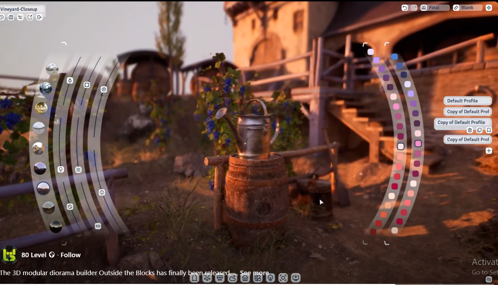
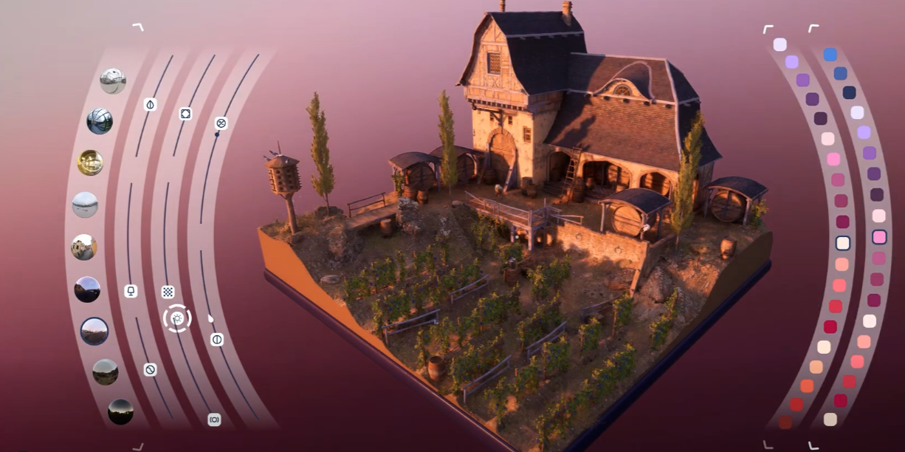

# Medium Priority

- [ ] Implement folder watcher or new file finder function with callbacks.
- [✓] Switch to img viewer by choosing 2D camera in camera menu
- [✓] Browser Widget (for comfyui integration)
- [ ] implement whisperthunder and pollinations as extensions/plugins
- [ ] Keyframe right click: choose/edit 3d/edit 2d/etc.
- [30%] CUI workflow to CTX
- [✓] CUI Workflof: Checkbox to expose value in gui
- [✓] Uniform scale
- [ ] Add undo/redo functionality
- [ ] Optimize render pipeline performance
- [✓] Save one extra image to prevent early image load
- [✓] Middle click revert to default 
- [30%] Implement prefs manager and config classes
- [✓] BG image should generate upscaled image and set it to bg
- [✓] set_workflow should be able to get only workflow name as well as full path
- [✓] Add primitive shapes
- [20%] Implement plugin system
- [ ] Add theme customization options
- [ ] Open tutorial videos from right click dropdown.
- [ ] Optimize memory usage in mesh loader.
- [ ] 2D edit area b-button (shape extended) 
- [ ] Text edit area for b-button
- [ ] Add material system for mesh objects
- [ ] Implement scene save/load functionality
- [ ] Create user documentation
- [ ] Improve object selection feedback
- [80%] Store values inside ars_window.prefs
- [80%] Read values from ars_window.prefs
- [ ] A|B compare
- [ ] Implement better workflow converter for open_j
- [ ] Interactive infinite zoom
- [✓] CLEANUP C4D PLUGIN!!!!!!!!!!!!!!!!!
- [ ] alt+scroll move camera instead of zooming
- [ ] 
- [ ] 
- [ ] 

# General Ideas

- [ ] pressing G key starts displaying object placement indicator (sphere with ray fron center up to sky) in viewport's surfaces. releasing opens ctx menu.

- [70%] Save image steps inside final image as metadata

- [✓] First step of animation generation can be a mix of first image and last image by applying generation steps from metadata.

- [✓] b_button: Hover enter callback, Hover leave callback

- [ ] Solo mode. World grid shrinks to object_size * 5 and centers to it. bg gets darker. Unnecessary buttons get removed.
focus/solo mode button in obj ctx menu. in sprite, it  zooms camera onto sprite and switches to image viewer. in obj, it removes/hides all objects and zooms to object.

- [ ] in gizmo mode(any gizmo mode) when modifier key(ctrl, shift, alt or else) is pressed, placement tool is activated. it displays placement pointer under cursor. first click drags object to that point in space. second click rotates it to appropriate direction

- [ ] Object Cration Object/Widget in Center: Right click opens objects list, left click opens object creation multiline prompt input

- [ ] Right click opens render dropdown, left click starts rendering.

- [50%] Mouse wheel should rotate object during dragging process

- [ ] Mouse wheel should change direction of follow mode

- [ ] Sartup video, animated transition from top to world origin. in the end video slowly becamse transparent. another video of floating bubbles stack in top middle.

- [ ] Geometry primitives to ai mesh. Combine multiple primitives and generate mash based on depth path + canny.

- [✓] Floating window should open at the position of selected bubble. Fb messenger style

- [ ] "tabler.io" and "lucide.dev" wrapper/converter. 

- [ ] Semi radial side menus  

- [ ] config.options should accept tuple of different types. str for name, list for slider values, lambda function for callbackL. (bool for enable/disable maybe?)

- [ ] Adaptive drag and drop area. When dropping image, it should show huge area for setting background and several small areas (h-list) of other options

- [ ] C4D Mesh To Texture > insert 3d object and using canny controlnet, generate new texture for it.

- [ ] 

- [ ] 

- [ ] 