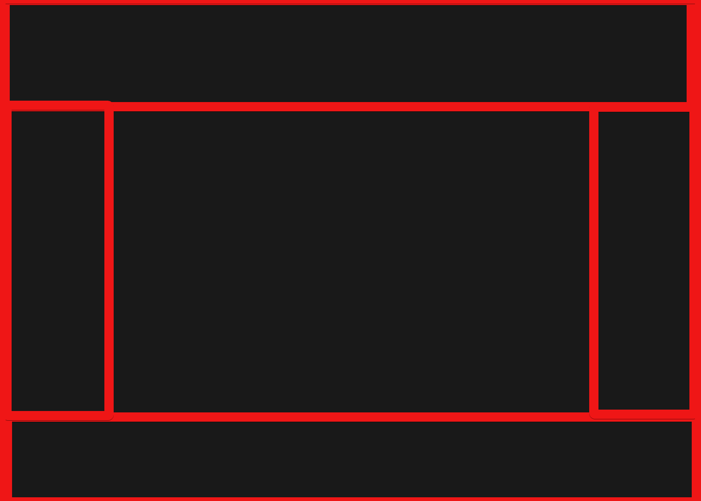

# Medium Priority

- [80%] Read values from ars_window.prefs
- [80%] Store values inside ars_window.prefs
- [30%] CUI workflow to CTX
- [30%] Implement prefs manager and config classes
- [20%] Implement plugin system

- [ ] Overlay widget that will replace the bubbles layout. It should distribute CTX windows instead of bubbles. splitters should be added to avoid overlapping. The center part should have a click-through area. 
- [ ] Right click on button in CTX menu, should make all b-buttons semi transparent (except the one under cursor) and open radial menu with b-button options.
- [ ] Move temp values to ars_window.prefs
- [ ] Implement folder watcher or new file finder function with callbacks.
- [ ] implement whisperthunder and pollinations as extensions/plugins
- [ ] Keyframe right click: choose/edit 3d/edit 2d/etc.
- [ ] Add ctrl+z/ctrl+y undo/redo functionality
- [ ] Optimize render pipeline performance
- [ ] Add ctrl+shift+z/ctrl+shift+y camera move undo/redo functionality
- [ ] Add theme customization options
- [ ] Open tutorial videos from right click dropdown.
- [ ] Optimize memory usage in mesh loader.
- [ ] 2D edit area b-button (shape extended) 
- [ ] Add material system for mesh objects
- [ ] Implement scene save/load functionality
- [ ] Create user documentation
- [ ] Improve object selection feedback
- [ ] A|B compare
- [ ] Implement better workflow converter for open_j
- [ ] Interactive infinite zoom
- [ ] Add new gizmo that will execute move_to and get_xyz commands.
- [ ] Hover over incremental value containing b-button shows value.
- [ ] Remove preview object during pressing G and add distance depended point.
- [ ] https://github.com/meshsplatting/mesh-splatting
- [ ] Trigger new render based on new "undo item" instead of time period. 
- [ ] 

# Secret Release
- [ ] Customer should get working version of Airen 
- [ ] Closed playlist should be created on youtube
- [ ]

# General Ideas

- [70%] Save image steps inside final image as metadata
- [50%] in gizmo mode(any gizmo mode) when modifier key(ctrl, shift, alt or else) is pressed, placement tool is activated. it displays placement pointer under cursor. first click drags object to that point in space. second click rotates it to appropriate direction[✓]: this feature is now implemented in different way. continuously pressing Q drags object. rotation is not yet implemented.
- [50%] Mouse wheel should rotate object during dragging process
- [ ] Solo mode. World grid shrinks to object_size * 5 and centers to it. bg gets darker. Unnecessary buttons get removed.
focus/solo mode button in obj ctx menu. in sprite, it  zooms camera onto sprite and switches to image viewer. in obj, it removes/hides all objects and zooms to object.
- [ ] Object Creation Object/Widget in Center: Right click opens objects list, left click opens object creation multiline prompt input
- [ ] Right click opens render dropdown, left click starts rendering.
- [ ] Mouse wheel should change direction of follow mode
- [ ] Startup video, animated transition from top to world origin. in the end video slowly became transparent. another video of floating bubbles stack in top middle.
- [ ] Geometry primitives to ai mesh. Combine multiple primitives and generate mesh based on depth path + canny.
- [ ] "tabler.io" and "lucide.dev" wrapper/converter. 
- [ ] Semi radial side menus  
- [ ] config.options should accept tuple of different types. str for name, list for slider values, lambda function for callbackL. (bool for enable/disable maybe?)
- [ ] Adaptive drag and drop area. When dropping image, it should show huge area for setting background and several small areas (h-list) of other options
- [ ] C4D Mesh To Texture > insert 3d object and using canny controlnet, generate new texture for it.
- [ ] Current Code: sound_manager.py (and pygame usage in main.py)
Functionality: Initializes audio and plays sound effects.
Recommended Library: playsound or simpleaudio
Why: The project currently imports the heavy pygame library solely for playing simple sound effects. If you are not using Pygame for windowing or game loops, switching to a lightweight audio library can significantly reduce your dependency footprint.
- [ ] Browser widget should be stored inside ui/widgets as a class. it should be added inside main_window. It should have methods to hide/unhide, set_tab_id, get_tab_id, open_link, ...
It will be used not only for ComfyUI but also for tabler & lucid icons, documentation viewer, video tutorial viewer, etc. 
- [ ] from ars_3d_engine.gizmo.gizmo import screen_to_world_ray, move screen_to_world_ray into its own module. 
- [ ] Scroll selector dropdown menu. can be used with continious key checker to choose between different options by scrolling up and down. key release will select result of scroll. (alternatively can be used semi radial menus for the same purpose)
- [ ] Tabs gui similar to the hierarchy menu
- [ ] Move object 2 units up during Q dragging mode and drop on end.
- [ ] Delete gizmo from viewport completely and re initilize it only if needed.
- [ ] 
- [ ] 
- [ ] 
- [ ] 
- [ ] 
- [ ] 
- [ ] 
- [ ] 
- [ ] 

## Finished

- [✓] Single click on b_button should activate text edit field event.
- [✓] Text edit area for b-button
- [✓] Q drag should change parent of the object. grid=None, obj=obj
- [✓] When pressing Q key, first play object move-to animation and then start realtime move-to dragging.
- [✓] Sound effect and color animation when selecting object.
- [✓] Scrolling wheel during presing G key should switch between primitive objects and apply an apropriate symbol. (maybe via cursor_follower)
- [✓] Scrolling wheel during pressing Q key should rotate the object.
- [✓] Switch to img viewer by choosing 2D camera in camera menu
- [✓] Browser Widget (for comfyui integration)
- [✓] CUI Workflow: Checkbox to expose value in gui
- [✓] Uniform scale
- [✓] Save one extra image to prevent early image load
- [✓] Middle click revert to default 
- [✓] BG image should generate upscaled image and set it to bg
- [✓] set_workflow should be able to get only workflow name as well as full path
- [✓] Add primitive shapes
- [✓] CLEANUP C4D PLUGIN!
- [✓] alt+scroll move camera instead of zooming
- [✓] Camera fly to cursor ray intersection on surface (need to plan the hotkey)
- [✓] pressing G key starts displaying object placement indicator (sphere with ray from center up to sky) in viewport's surfaces. releasing opens ctx menu.
- [✓] First step of animation generation can be a mix of first image and last image by applying generation steps from metadata.
- [✓] b_button: Hover enter callback, Hover leave callback
- [✓] Floating window should open at the position of selected bubble. Fb messenger style
- [✓] add timer, if time is low use cursor_to_xyz_cmd inside gizmo selector with timer.  else open gizmo selector. (or set cursor_to_xyz_cmd to q>q)