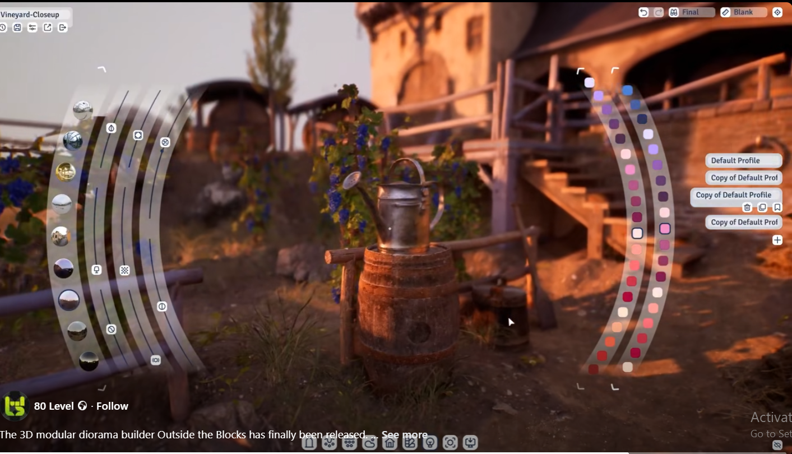
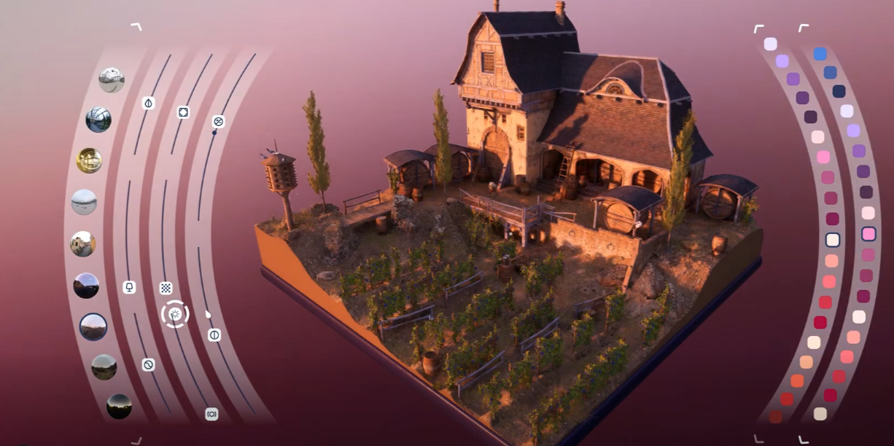

# TODO List

## Links / Inspiration
https://huggingface.co/spaces/multimodalart/Apply-Texture-Qwen-Image-Edit
https://uiverse.io/
https://viewport-ui.design/uploads/x.com_yWwccl9ToXO8Nl4r.mp4
https://civitai.com/models/558755/pbr-seamless-textures-workflow-xl-v10
https://civitai.com/models/575474/textures-fluxsdxlpony
https://www.facebook.com/reel/791143173656282
https://www.facebook.com/reel/2631619090526695
https://www.facebook.com/reel/809604318718913
https://huggingface.co/dx8152/Qwen-Image-Edit-2509-Fusion
https://huggingface.co/dx8152/Qwen-Edit-2509-Multi-Angle-Lighting

## Code Editor
- [ ] Ctrl+F Find / Search
- [ ] Multi cursor placement
- [ ] Ctrl+Shift+A find all selected
- [ ] Option to disable/enable line wrap: self.setLineWrapMode(QPlainTextEdit.LineWrapMode.NoWrap)
- [ ] Custom Themes. f"background-color: rgba(0, 0, 0, {1.0 if STANDALONE else 0.15})
- [✓] Auto Completion
- [ ] Custom completion for icons. "ic." triggers icons list.
- [✓] Move selected lines up/down using arrow keys.
- [ ] Transparency Slider for revialing scene behind editor.
- [ ] 
- [ ] 

## High Priority
- [✓] Uniform scale
- [ ] Add undo/redo functionality
- [ ] Optimize render pipeline performance
- [ ] Save one extra image to prevent early image load
- [ ] Middle click revert to default 

## Medium Priority
- [ ] Add material system for mesh objects
- [ ] Implement scene save/load functionality
- [ ] Create user documentation
- [ ] Improve object selection feedback

## Low Priority
- [✓] Add primitive shapes
- [20%] Implement plugin system
- [ ] Add theme customization options
- [ ] Open tutorial videos from right click dropdown.
- [ ] Optimize memory usage in mesh loader.
- [ ] 2D edit area b-button (shape extended) 

## Bug Fixes
- [ ] Fix gizmo rotation
- [ ] Resolve sprite rendering artifacts
- [50%] Fix object manager deletion issues

## Future Features
- [ ] Gaussian Splatting (3DGS)
- [ ] Physics simulation
- [ ] Advanced lighting system

##
- [ ] Space invaders 
- [10%] Snake
- [ ] Tetris
- [ ] Atari Breakout

## General Ideas
- [ ] pressing G key starts displaying object placement indicator (sphere with ray fron center up to sky) in viewport's surfaces. releasing opens ctx menu.

- [70%] Save image steps inside final image as metadata

- [ ] First step of animation generation can be a mix of first image and last image by applying generation steps from metadata.

- [✓] b_button: Hover enter callback, Hover leave callback

- [ ] Solo mode. World grid shrinks to object_size * 5 and centers to it. bg gets darker. Unnecessary buttons get removed.
focus/solo mode button in obj ctx menu. in sprite, it  zooms camera onto sprite and switches to image viewer. in obj, it removes/hides all objects and zooms to object.

- [ ] in gizmo mode(any gizmo mode) when modifier key(ctrl, shift, alt or else) is pressed, placement tool is activated. it displays placement pointer under cursor. first click drags object to that point in space. second click rotates it to appropriate direction

- [ ] Object Cration Object/Widget in Center: Right click opens objects list, left click opens object creation multiline prompt input

- [ ] Right click opens render dropdown, left click starts rendering.

- [50%] Mouse wheel should rotate object during dragging process

- [ ] Mouse wheel should change direction of follow mode

- [ ] Sartup video, animated transition from top to world origin. in the end video slowly becamse transparent. another video of floating bubbles stack in top middle.

- [ ] Geometry primitives to ai mesh. Combine multiple primitives and generate mash based on depth path + canny.

- [✓] Floating window should open at the position of selected bubble. Fb messenger style

- [ ] 

- [ ] Semi radial side menus  

- [ ] 
